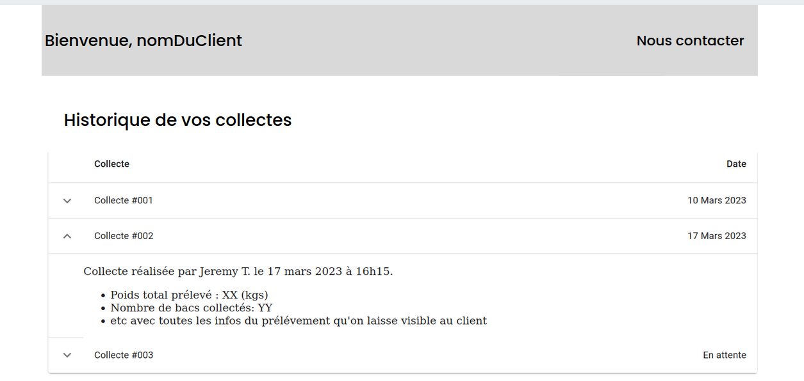
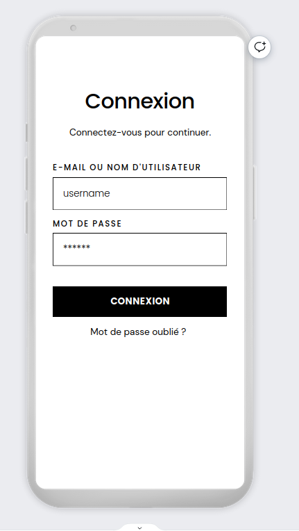
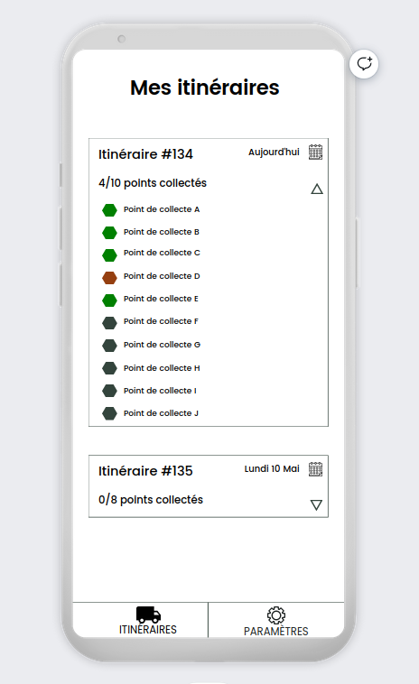
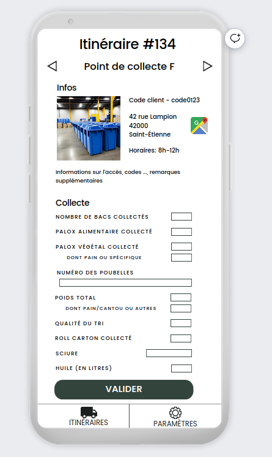

Proposition de maquettes des différents composants:

Petite réflexion sur ce à quoi ca pourrait ressembler de mon point de vue, avant de commencer à développer. 

# Site web Client

L'idée c'est de faire quelque chose de sobre, peut-être ajouter un logo ? 

- Bandeau Supérieur:
    - possibilité de cliquer sur nous contacter pour avoir accès à l'organigramme et aux méthodes de contact. 

- Historique des collectes: 

    - L'idée c'est d'avoir un tableau où on peut étendre les lignes pour voir le contenu de la collecte. C'était surtout pour valider ca, on fera qqch de + plus beau dans le contenu d'une collecte. 
    - on pourra aussi facilement trier sur les dates, faire des recherches sur le contenu etc. 

# Site web Administration

todo

# Application mobile pour les Collecteurs

Appli Collecteur -> utilisée par le collecteur qui part en tournée. 

## Page de connexion à l'application

Système proposé pour pas que ce soit contraignant de créer un compte: 

- Sur la page administration du site, possibilité d'ajout un employé et de définir son mot de passe par défaut. 
- L'employé se connecte avec son email et son mot de passe (qu'il peut changer ensuite à l'insu de l'administrateur). 

## Vue Itinéraires

- Page d'accueil pour un employé qui se connecte ou est connecté.
- Vue des itinéraires qui lui sont affectées sous forme de liste déroulante, triés par date à laquelle la tournée doit être effectuée. 
- En appuyant sur la flèche, on voit les points de collecte qui font partie de la tournée. 
- Menu en bas permettant de switcher entre les vues itinéraires (celle-ci) ou paramètres (permettant a priori seulement de voir en tant que qui on est connectés et se déconnecter). 

Code couleur (mis un peu au hasard) 
- vert: collecté
- orange sombre: zappé ou pb à la collecte  
- gris: à collecter

L'idée est de pouvoir cliquer sur le point de collecte dans la liste d'un itinéraire pour arriver à la page de collecte et remplir les informations.

## Vue Collecte d'un point

- Flèches en haut pour passer au point de collecte précédent/suivant dans la collecte. (ou swipe)

- Partie Infos:

    - Afficher les infos principales sur le point de collecte (code client, adresse, plage horaire, toutes les informations que l'on veut) 
    - lien vers google maps (ou autre système de navigation) pour faire l'itinéraire. 

- Partie Collecte

    - Reprise du google forms (volontairement incomplet sur la maquette) 
    - Bouton valider pour soumettre les informations de la collecte (les informations sur la date, le collecteur peuvent être automatiques)

- Menu Itinéraires/Paramètres toujours présent.  

